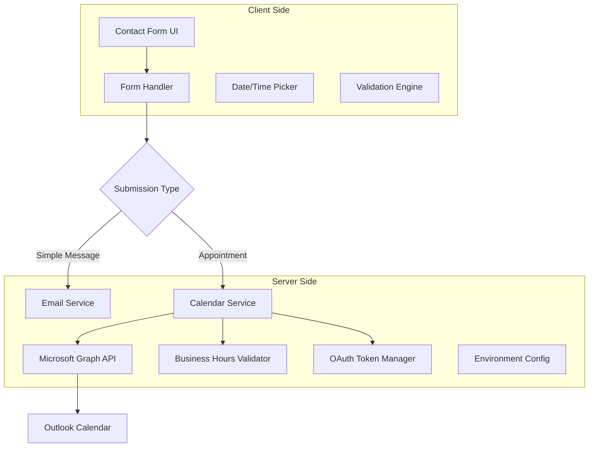

# Design Document

## Overview

The calendar booking integration feature extends the existing Kamlease contact form to support appointment scheduling through Microsoft Graph API. The system provides two submission modes: simple message sending and appointment booking with automatic calendar event creation. The design emphasizes user experience, security, and robust error handling while maintaining the existing form's visual consistency.

## Architecture

### High-Level Architecture



### Component Interaction Flow

1. **Form Initialization**: Contact form loads with two submission options
2. **Appointment Mode**: User selects appointment booking, date/time picker appears
3. **Client Validation**: Business hours and date validation on client side
4. **Form Submission**: Data sent to appropriate handler based on submission type
5. **Server Processing**: OAuth authentication, API call, and calendar event creation
6. **User Feedback**: Success/error messages displayed to user

## Components and Interfaces

### Frontend Components

#### Enhanced Contact Form Component
```typescript
interface ContactFormData {
  nom: string
  prenom: string
  societe: string
  message: string
  appointmentDate?: Date
  appointmentTime?: string
}

interface ContactFormProps {
  onSubmit: (data: ContactFormData, type: 'message' | 'appointment') => Promise<void>
}
```

#### Date/Time Picker Component
```typescript
interface AppointmentPickerProps {
  selectedDate: Date | null
  selectedTime: string | null
  onDateChange: (date: Date | null) => void
  onTimeChange: (time: string | null) => void
  businessHours: BusinessHours
  timezone: string
}

interface BusinessHours {
  days: number[] // 1-5 for Monday-Friday
  startTime: string // "14:00"
  endTime: string // "16:30"
  timezone: string // "Europe/Paris"
}
```

### Backend Services

#### Calendar Service Interface
```typescript
interface CalendarService {
  createAppointment(data: AppointmentData): Promise<CalendarEvent>
  validateBusinessHours(date: Date, time: string): boolean
  getAvailableSlots(date: Date): Promise<TimeSlot[]>
}

interface AppointmentData {
  subject: string
  startDateTime: string
  endDateTime: string
  timeZone: string
  attendeeInfo: {
    prenom: string
    nom: string
    societe?: string
    message: string
  }
}
```

#### OAuth Token Manager
```typescript
interface TokenManager {
  getAccessToken(): Promise<string>
  refreshToken(): Promise<string>
  isTokenValid(): boolean
}

interface GraphApiConfig {
  tenantId: string
  clientId: string
  clientSecret: string
  scope: string
}
```

## Data Models

### Form Data Model
```typescript
interface ContactSubmission {
  id: string
  type: 'message' | 'appointment'
  formData: {
    nom: string
    prenom: string
    societe?: string
    message: string
  }
  appointmentDetails?: {
    date: string // ISO date
    time: string // HH:mm format
    timezone: string
  }
  submittedAt: Date
  status: 'pending' | 'success' | 'failed'
  errorMessage?: string
}
```

### Calendar Event Model
```typescript
interface CalendarEvent {
  id: string
  subject: string
  start: {
    dateTime: string // ISO 8601
    timeZone: string
  }
  end: {
    dateTime: string // ISO 8601
    timeZone: string
  }
  body: {
    contentType: 'Text' | 'HTML'
    content: string
  }
  attendees?: Attendee[]
}
```

### Business Hours Configuration
```typescript
interface BusinessHoursConfig {
  timezone: string // "Europe/Paris"
  workingDays: {
    monday: boolean
    tuesday: boolean
    wednesday: boolean
    thursday: boolean
    friday: boolean
    saturday: boolean
    sunday: boolean
  }
  dailySchedule: {
    startTime: string // "14:00"
    endTime: string // "16:30"
    slotDuration: number // 30 minutes
  }
}
```

## Error Handling

### Client-Side Error Handling

1. **Validation Errors**
   - Real-time field validation
   - Business hours validation
   - Date/time format validation
   - Required field validation

2. **Network Errors**
   - Connection timeout handling
   - Retry mechanism for failed requests
   - Graceful degradation to email-only mode

3. **User Feedback**
   - Inline error messages
   - Toast notifications for system errors
   - Loading states during processing

### Server-Side Error Handling

1. **Authentication Errors**
   - OAuth token expiration
   - Invalid credentials
   - API permission issues

2. **API Errors**
   - Microsoft Graph API rate limiting
   - Calendar service unavailability
   - Invalid request format

3. **Business Logic Errors**
   - Outside business hours
   - Invalid date selection
   - Conflicting appointments

### Error Recovery Strategies

```typescript
interface ErrorRecoveryStrategy {
  retryAttempts: number
  backoffStrategy: 'linear' | 'exponential'
  fallbackAction: 'email' | 'queue' | 'notify'
  userNotification: string
}

const errorStrategies: Record<string, ErrorRecoveryStrategy> = {
  'AUTH_FAILED': {
    retryAttempts: 3,
    backoffStrategy: 'exponential',
    fallbackAction: 'email',
    userNotification: 'Booking temporarily unavailable, message sent instead'
  },
  'RATE_LIMITED': {
    retryAttempts: 2,
    backoffStrategy: 'linear',
    fallbackAction: 'queue',
    userNotification: 'Request queued, you will receive confirmation shortly'
  }
}
```

## Testing Strategy

### Unit Testing
- Form validation logic
- Business hours calculation
- Date/time utilities
- OAuth token management
- API request/response handling

### Integration Testing
- Microsoft Graph API integration
- End-to-end form submission flow
- Error handling scenarios
- Calendar event creation verification

### User Acceptance Testing
- Form usability testing
- Appointment booking workflow
- Error message clarity
- Mobile responsiveness
- Accessibility compliance

### Performance Testing
- API response times
- Form submission performance
- Large date range handling
- Concurrent user scenarios

## Security Considerations

### Authentication & Authorization
- OAuth 2.0 client credentials flow
- Secure credential storage (environment variables)
- Token refresh mechanism
- API permission scoping (Calendars.ReadWrite)

### Data Protection
- Input sanitization and validation
- XSS prevention in form fields
- CSRF protection for form submissions
- Secure transmission (HTTPS only)

### Privacy Compliance
- GDPR compliance for data collection
- User consent for calendar access
- Data retention policies
- Right to deletion implementation

## Implementation Phases

### Phase 1: Core Infrastructure
- OAuth token management setup
- Microsoft Graph API integration
- Basic calendar event creation
- Environment configuration

### Phase 2: UI Enhancement
- Date/time picker component
- Form mode switching
- Client-side validation
- Loading states and feedback

### Phase 3: Business Logic
- Business hours validation
- Time slot availability
- Conflict detection
- Error handling implementation

### Phase 4: Testing & Polish
- Comprehensive testing suite
- Error message localization
- Performance optimization
- Accessibility improvements

## Configuration Management

### Environment Variables
```bash
# Microsoft Graph API Configuration
MICROSOFT_TENANT_ID=your-tenant-id
MICROSOFT_CLIENT_ID=your-client-id
MICROSOFT_CLIENT_SECRET=your-client-secret
MICROSOFT_SCOPE=https://graph.microsoft.com/.default

# Business Configuration
CALENDAR_EMAIL=contact@kamlease.com
BUSINESS_TIMEZONE=Europe/Paris
BUSINESS_START_TIME=14:00
BUSINESS_END_TIME=16:30
APPOINTMENT_DURATION=30

# Feature Flags
ENABLE_CALENDAR_BOOKING=true
ENABLE_APPOINTMENT_CONFLICTS=true
ENABLE_EMAIL_FALLBACK=true
```

### Runtime Configuration
```typescript
interface AppConfig {
  microsoftGraph: {
    tenantId: string
    clientId: string
    clientSecret: string
    scope: string
  }
  business: {
    calendarEmail: string
    timezone: string
    workingHours: {
      start: string
      end: string
    }
    appointmentDuration: number
  }
  features: {
    calendarBooking: boolean
    conflictDetection: boolean
    emailFallback: boolean
  }
}
```

## Monitoring and Observability

### Metrics to Track
- Form submission success/failure rates
- Calendar API response times
- Authentication failure rates
- User interaction patterns
- Error frequency by type

### Logging Strategy
- Structured logging for API calls
- User action tracking (anonymized)
- Error logging with context
- Performance metrics collection

### Alerting
- API authentication failures
- High error rates
- Calendar service unavailability
- Form submission anomalies