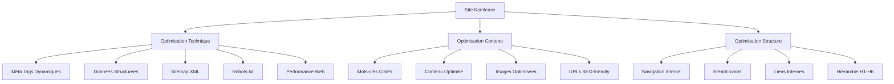

# Document de Conception - Optimisation SEO

## Vue d'ensemble

Cette conception détaille l'implémentation d'une stratégie SEO complète pour le site Kamlease, une entreprise spécialisée en mécatronique, électronique et auto-staging. L'objectif est d'améliorer significativement la visibilité du site sur les moteurs de recherche en optimisant les aspects techniques, le contenu et la structure.

## Architecture

### Architecture SEO Globale



### Mots-clés Stratégiques Identifiés

**Mots-clés Primaires:**
- "solutions mécatroniques"
- "électronique industrielle"
- "auto-staging"
- "ingénierie mécatronique"

**Mots-clés Secondaires:**
- "conception électronique"
- "développement produits industriels"
- "optimisation coûts industriels"
- "innovation mécatronique"
- "expertise automobile"

**Mots-clés Longue Traîne:**
- "adaptation produits automobiles industrie"
- "solutions mécatroniques sur mesure"
- "développement électronique industriel France"
- "optimisation processus industriels"

## Composants et Interfaces

### 1. Système de Meta Tags Dynamiques

**Interface SEOMetaManager**
```typescript
interface SEOMetaManager {
  updatePageMeta(pageData: PageSEOData): void
  generateStructuredData(type: StructuredDataType, data: any): string
  updateOpenGraphTags(ogData: OpenGraphData): void
  updateTwitterCardTags(twitterData: TwitterCardData): void
}

interface PageSEOData {
  title: string
  description: string
  keywords: string[]
  canonicalUrl: string
  language: 'fr' | 'en'
  lastModified: Date
}
```

**Implémentation par Page:**
- **Page d'accueil:** "Kamlease - Solutions Mécatroniques et Électroniques Innovantes | Auto-staging"
- **À propos:** "Expertise Mécatronique et Auto-staging - 30 ans d'expérience | Kamlease"
- **Contact:** "Contactez Kamlease - Devis Solutions Mécatroniques et Électroniques"

### 2. Système de Données Structurées

**Types de Schema.org à implémenter:**
- **Organization:** Informations sur Kamlease
- **LocalBusiness:** Données de contact et localisation
- **Service:** Description des services mécatroniques
- **WebSite:** Configuration du site avec SearchAction
- **BreadcrumbList:** Navigation hiérarchique

**Exemple de Structure Organization:**
```json
{
  "@context": "https://schema.org",
  "@type": "Organization",
  "name": "Kamlease",
  "description": "Solutions innovantes en mécatronique, électronique et auto-staging",
  "url": "https://kamlease.com",
  "logo": "https://kamlease.com/assets/logos/Logo-Black-for-white-background.svg",
  "contactPoint": {
    "@type": "ContactPoint",
    "telephone": "+33-X-XX-XX-XX-XX",
    "contactType": "customer service",
    "availableLanguage": ["French", "English"]
  },
  "sameAs": [
    "https://linkedin.com/company/kamlease"
  ]
}
```

### 3. Générateur de Sitemap XML

**Interface SitemapGenerator**
```typescript
interface SitemapGenerator {
  generateSitemap(): string
  addPage(url: string, priority: number, changefreq: string): void
  addMultilingualPage(baseUrl: string, languages: string[]): void
}

interface SitemapEntry {
  url: string
  lastmod: string
  changefreq: 'always' | 'hourly' | 'daily' | 'weekly' | 'monthly' | 'yearly' | 'never'
  priority: number
  alternates?: AlternateLink[]
}
```

**Structure du Sitemap:**
- Page d'accueil (priority: 1.0, changefreq: weekly)
- Pages principales (priority: 0.8, changefreq: monthly)
- Pages légales (priority: 0.3, changefreq: yearly)

### 4. Optimisation des Images

**Interface ImageOptimizer**
```typescript
interface ImageOptimizer {
  generateResponsiveImages(src: string): ResponsiveImageSet
  generateAltText(context: string, language: Language): string
  optimizeForSEO(imageData: ImageSEOData): OptimizedImage
}

interface ImageSEOData {
  src: string
  context: string
  keywords: string[]
  language: Language
}
```

**Stratégie d'optimisation:**
- Formats WebP avec fallback
- Lazy loading avec intersection observer
- Alt text descriptif avec mots-clés
- Tailles responsive adaptées

## Modèles de Données

### 1. Configuration SEO Globale

```typescript
interface SEOConfig {
  site: {
    name: string
    description: string
    url: string
    logo: string
    defaultLanguage: Language
    supportedLanguages: Language[]
  }
  keywords: {
    primary: string[]
    secondary: string[]
    longTail: string[]
  }
  social: {
    twitter: string
    linkedin: string
    facebook?: string
  }
  analytics: {
    googleAnalyticsId?: string
    googleSearchConsoleId?: string
  }
}
```

### 2. Modèle de Page SEO

```typescript
interface PageSEO {
  id: string
  path: string
  title: {
    fr: string
    en: string
  }
  description: {
    fr: string
    en: string
  }
  keywords: string[]
  priority: number
  changefreq: string
  structuredData?: StructuredDataType[]
  customMeta?: MetaTag[]
}
```

### 3. Modèle de Contenu Optimisé

```typescript
interface OptimizedContent {
  headings: {
    h1: string
    h2: string[]
    h3: string[]
  }
  keywordDensity: {
    [keyword: string]: number
  }
  internalLinks: InternalLink[]
  images: OptimizedImage[]
  readabilityScore: number
}
```

## Gestion des Erreurs

### 1. Erreurs SEO Techniques

**Stratégie de gestion:**
- Validation des meta tags avant injection
- Fallback pour les données structurées manquantes
- Monitoring des erreurs 404 et redirections
- Validation du sitemap XML

**Exemple de gestion d'erreur:**
```typescript
class SEOErrorHandler {
  handleMissingMetaData(pageId: string): void {
    // Utiliser des valeurs par défaut
    // Logger l'erreur pour correction
    // Notifier l'équipe de développement
  }
  
  handleInvalidStructuredData(data: any): void {
    // Valider contre le schéma JSON-LD
    // Corriger automatiquement si possible
    // Désactiver si critique
  }
}
```

### 2. Erreurs de Performance

**Monitoring et correction:**
- Surveillance des Core Web Vitals
- Optimisation automatique des images
- Mise en cache intelligente
- Compression des ressources

## Stratégie de Test

### 1. Tests Techniques SEO

**Tests automatisés:**
- Validation des meta tags sur toutes les pages
- Vérification de la structure des données
- Test de la génération du sitemap
- Validation des URLs canoniques

**Outils de test:**
- Google Search Console
- Lighthouse SEO audit
- Schema.org validator
- Mobile-friendly test

### 2. Tests de Performance

**Métriques à surveiller:**
- First Contentful Paint (FCP) < 1.8s
- Largest Contentful Paint (LCP) < 2.5s
- Cumulative Layout Shift (CLS) < 0.1
- First Input Delay (FID) < 100ms

### 3. Tests de Contenu

**Validation du contenu:**
- Densité des mots-clés (1-3%)
- Présence des mots-clés dans les titres
- Qualité des liens internes
- Optimisation des images

## Stratégie d'Internationalisation

### 1. Configuration Multilingue

**Implémentation hreflang:**
```html
<link rel="alternate" hreflang="fr" href="https://kamlease.com/" />
<link rel="alternate" hreflang="en" href="https://kamlease.com/en/" />
<link rel="alternate" hreflang="x-default" href="https://kamlease.com/" />
```

**Structure des URLs:**
- Français (défaut): `https://kamlease.com/`
- Anglais: `https://kamlease.com/en/`

### 2. Contenu Localisé

**Adaptation par langue:**
- Meta tags traduits et adaptés culturellement
- Mots-clés spécifiques à chaque marché
- Données structurées localisées
- Contenu adapté aux recherches locales

## Monitoring et Analytics

### 1. KPIs SEO à Suivre

**Métriques de visibilité:**
- Positions moyennes sur les mots-clés cibles
- Nombre de pages indexées
- Trafic organique par page
- Taux de clics (CTR) dans les SERP

**Métriques techniques:**
- Score Lighthouse SEO
- Erreurs d'exploration
- Temps de chargement des pages
- Taux de rebond

### 2. Outils de Monitoring

**Intégrations recommandées:**
- Google Search Console
- Google Analytics 4
- Google PageSpeed Insights
- Schema.org Testing Tool

**Reporting automatisé:**
- Rapport hebdomadaire des positions
- Alertes sur les erreurs critiques
- Suivi des Core Web Vitals
- Analyse de la concurrence

## Sécurité et Conformité

### 1. Conformité RGPD

**Gestion des données:**
- Consentement pour les cookies analytics
- Anonymisation des données utilisateur
- Droit à l'oubli dans les analytics
- Transparence sur la collecte de données

### 2. Sécurité SEO

**Protection contre:**
- Injection de contenu malveillant
- Spam de liens
- Détournement de trafic
- Attaques de negative SEO

**Mesures de sécurité:**
- Validation stricte des données
- Monitoring des backlinks
- Protection contre le scraping
- Surveillance des modifications non autorisées